# 使用说明 v2.4.0
## 参数表说明
&emsp; &emsp; 文件 **Csv_reader_ParaTemplate.m** 为基础示例输入参数表，**禁止修改**，运行该文件将读取 TestLib 中数据，以验证程序是否能良好运转。在实验数据读取时，应当另创一个新的m文件，将参数表内容复制过去，再修改参数使用。
&emsp; &emsp; 具体参数说明如下：
- #### 文件配置参数
    - ##### Para_file.location
        &emsp; &emsp;数据读取以及读取结果输出路径，字符串类型。实验时应当在U盘根目录建立八位日期名文件夹存放数据，运行程序读取数据时，可直接复制路径到此参数。
            &emsp; &emsp;示例: 'E:\20250723'
    - ##### Para_file.tablename
        &emsp; &emsp;数据文件名，对应示波器在保存CSV文件时填入的文件名称，字符串类型。实验时应当以测试器件的器件类型或器件类型+器件位置命名。
            &emsp; &emsp;示例: 'INVA'、'INVB'、'BOOST'
    - ##### Para_file.dataname
        &emsp; &emsp;输出数据表名，同样为输出图像文件夹名，字符串类型。长度不应超过28个字符，否则会报错。实验时应当以“(机型)-(器件)-(温度)-(电压)-(备注)”命名，备注部分主要体现于其他组的差异，如在配置驱动参数时，可将驱动参数作为备注。
            &emsp; &emsp;示例: '320英飞凌-BT1-常温-600-内管加电容'、'320全斯达-AT4-常温-600-2.0-9.4'   
    - ##### Para_file.datstart
        &emsp; &emsp;该组数据的起始编号，程序将从后缀为该数字的数据文件开始读取，正整数类型，填写001与1效果相同。
        &emsp; &emsp;示例: 1、02、003
    - ##### Para_file.datnum
        &emsp; &emsp;该组数据的数量，程序将从起始编号开始读取该数量个数据为一组，正整数类型。若仅看单个CSV文件，此项填1；多个SCV文件，按照文件数量填写即可
- #### 模式配置参数
    - ##### ~~Para_mode.nspd~~ (已在V2.1.8版本后删除，改为直接读文件计算)
        ~~&emsp; &emsp;示波器采样率，两个采样点之间的时间间隔，ns为单位，正小数类型。该数据与di/dt、dv/dt等时间关联数据有强相关，建议仔细核对文件的采样率，可打开CSV文件查看，一般取 1.6 或 3.2 。~~
    - ##### Para_mode.Chmode
        &emsp; &emsp;通道分配模式，字符串型，仅 'setch' 和 'findch' 有效。'setch'为手动设置通道分配，'findch'为自动设置通道。目前自动设置模式并不稳定，建议手动设置。
    - ##### Para_mode.Ch_labels
        &emsp; &emsp;通道分配，仅在手动设置有效，正整数数组类型。其中五个元素分别代表 Vge、Vce、Ic、Vd、Id 的对应通道，若保存文件时示波器的ch1~ch5分别是以上数据，则此项填入 [1, 2, 3, 4, 5] ；若Id、Ic交换则填入 [1, 2, 5, 4, 3] ；若有其中某一项为示波器计算结果，则应当进入CSV文件仔细查看对应数据在第几列再减1填入此项(具体操作请查看常见问题)；若有一项未监测则在对应位置填入0，例如Vd未监测则填[1, 2, 3, 0, 5]
        &emsp; &emsp;同时此项包括了Ic、Id反相功能，在Ic或Id需要反相时，可在数组第三或五个数前加入负号，仅Ic、Id可用。
        &emsp; &emsp;计算哪些数据也受此项参数控制，原则上能计算的都会计算出来，但可以关闭其中的通道读取来取消对应数据的计算，例如Id和Vd处填0，则不会计算Prrmax和Erec。但Vge和Vce一定要有，Ic和I负载二选一，一定要有。
    - ##### Para_mode.Smooth_Win
        &emsp; &emsp;各通道滤波窗口长度，非负整数数组类型。其中五个元素分别为 Vge、Vce、Ic、Vd、Id、Vge_dg 的对应数据滤波窗口长度。一般情况下，Vce和Vd不需要滤波；Vge可以有3 ~ 5格长度的滤波；Ic和Id也同样可以有3 ~ 5格长度的滤波，若电流数据稳定，尽量不滤波。所有通道滤波都建议不要超过10，若在超高采样率下，报错Vge过零点大于6处，则可以考虑加大门极滤波长度。
    - ##### Para_mode.Eonmode
        &emsp; &emsp;开通损耗计算配置，浮点数数组类型。其中四个参数，第一个为损耗计算的左侧取点位置，开通损耗是左侧电流上升到百分之多少的Ictop作为基础起始点，例如，填入0.1，则损耗计算的基础起始点为电流上升段中达到10%Ictop的点；第二个为损耗计算的右侧取点，开通损耗为右侧电压下降到百分之多少的Vcetop作为基础结束点，例如填入0.02，则损耗计算的基础结束点为电压下降段中下降到2%Vcetop的点。后面两个参数则是，向左、向右分别扩充多长距离的比例，扩充比例的基准是原基础起始点到结束点之前长度，如填入 0.1，0.2 则代表在原起始点和结束点的基础上，向左扩充10%长度，向右扩充20%长度(基准长度不变)
            &emsp; &emsp;示例: [0.1, 0.02, 0.1, 0]
    - ##### Para_mode.Eoffmode
        &emsp; &emsp;关断损耗计算配置，浮点数数组类型。与开通损耗计算配置逻辑一致，其中有区别的是，关断损耗的左侧取点为左侧电压上升到百分之多少的Vcetop作为基础起始点；而右侧取点为右侧电流下降到百分之多少的Ictop作为基础结束点。其余部分与Eonmode完全一致。
            &emsp; &emsp;示例: [0.1, 0.02, 0.1, 0] 
    - ##### Para_mode.dvdtmode
        &emsp; &emsp;电压dvdt计算区间，正整数数组型。共四个参数，前两个为开通dvdt的计算选点，一般取 90, 10 ；后两个参数为关断dvdt的计算选点，一般的应当为 10, 90 ，但实际操作中，由于某些器件特性导致的前期极缓抬升，因此允许采用其他起始结束点，如果手动设置了计算区间，则关断dvdt的输出绘图以红色显示10%到90%区间的基础上，额外以绿色部分显示手动设置的区间。
            &emsp; &emsp;示例: [90, 10, 10, 90]、[60, 40, 10, 90] 
    - ##### Para_mode.didtmode
        &emsp; &emsp;电流didt计算区间，正整数数组型。共四个参数，与dvdt相同，前来两个参数为开通didt的选点，一般的应当为 10, 90 ，后两个为关didt的选点，因为，一般取 80, 20。这与dvdt计算区间设置原理相同，但不同的是，理论上didt的计算应当就是10%到90%Ictop，原则上不应当设置别的数值。但未防止状态机识别起始算法失效以及其他原因产生的报错影响读取，所以保留此接口。同时，与dvdt计算区间参数不同的是，手动设置计算区间后，输出将会变为只有手动设置段。PS：极端条件下，结束位置可以取到高于100%，但极度不推荐此参数。
            &emsp; &emsp;示例: [10, 90, 90, 10]、[10, 90, 80, 20]
    - ##### Para_mode.DuiguanMARK
        &emsp; &emsp;监测对管序号标记，正整数数组类型。用于标记监测的哪个或者哪几个对管门极，与 DuiguanCH 数组中的通道顺序必须一一对应。目前最多支持同时计算两个，当 DuiguanMARK 参数填入 [1,5] 、 DuiguanCH 参数填入 [6,4] 时，软件将会把通道 6 (4)的数据当作对管 T1(T5) 的 Vge 开始计算开通关断期间的最大最小值并输出图像。最后的数据表格中将会有 VgemaxT1(V)、VgeminT1(V)、VgemeanT1(V) 和 VgemaxT5(V)、VgeminT5(V)、VgemeanT5(V) 项，表头字符串的数字部分由 DuiguanMARK 参数决定。
    - ##### Para_mode.DuiguanCH
        &emsp; &emsp;监测对管通道标记，正整数数组类型。用于设置监测的对管门极数据在哪个通道，与 DuiguanMARK 数组中的通道顺序必须一一对应，若某一个通道标记为0，则关闭该通道的对管监测功能，即填入[6,0]，则表示仅有第六通道为对管检测通道;若实际上没有监测对管的通道则填入[0, 0]。
    - ##### Para_mode.Fuzaimode
        &emsp; &emsp;负载电流模式开关兼通道配置，非负整型。若填值不为0，则打开负载电流模式。填的数值+1则为负载电流数据在CSV文件中的列数。开启负载电流模式后，将无法计算损耗以及其他跟电流相关的数据，仅分析尖峰。
    - ##### Para_mode.INTG_I2t 
        &emsp; &emsp;Irms计算电流模式开关兼通道配置，非负整型。若填值不为0，则打开I2dt计算模式。填的数值则为电容电流数据在CSV文件中的列数。
    - ##### ~~Para_mode.Dflag~~(已与V2.0.3版本后删除，反向恢复分析改为通道分配控制)
        ~~&emsp; &emsp;二极管反向恢复计算使能开关，布尔类型。置1时将计算二极管反向恢复Prr和Erec，置0时将跳过该部分。若数据文件中未包括Id情况，则强烈建议关闭改选项。~~
    - ##### Para_mode.I_Fix
        &emsp; &emsp;电流自动校正开关，布尔类型数组。分为两个，第一个为电流"Ic"是否校正的开关；第二个是"Id"的校正开关，置为1时开启校正，为0时关闭校正。
            &emsp; &emsp;示例: [0, 0]、[1, 1]
    - ##### Para_mode.I_meature
        &emsp; &emsp;电流top计算来源，字符串哈希表。仅"Ic"、和"Id"有效，若填入"Ic"则是使用寻找关断时刻最大电流计算Ictop；若填入"Id"则是通过续流电流的静态范围均值计算Ictop。实际使用时，若实验时采用Ic确定实际电流则填入"Ic"；若实验时采用Id确定实际电流则填入"Id"。
            &emsp; &emsp;示例: "Id"、"Ic"
    - ##### Para_mode.gate_didt
        &emsp; &emsp;开通(关断)电流didt上升(下降)容错，非负整数类型，可填0。第一个参数为didt上升沿检测算法的检测窗口长度，若在i到i+gate_didt的区间内呈上升趋势则判断为上升；反之则判断为下降重置初始点。填0时即为设置成要求必须严格上升，即i+1的数值必须比i高。第二个参数为下降didt的对应参数，原理一致。实际使用时，若Ic数据线非常光滑，则可以填0关闭容错；若略有毛刺则可以填值3到5；不建议填30以上的值，下降容错则一般需要填大一点，大致10 ~ 30为宜。
            &emsp; &emsp;示例: [3,15]、[7,30]
    - ##### Para_mode.gate_Erec
        &emsp; &emsp;Erec计算反向恢复功率下降沿容错，非负整数类型，可填0。原理与didt上升容错大致相同，但由于Prr为Id和Vd的乘积，因此一般干扰都较大，所以填制都可以放大一些。常见填值10~50都有，需要视情况而定。
    - ##### Prra_draw.Vgeth
        &emsp; &emsp;门极开通电压，整数类型。用于判断开关时间以及绘图，原则上应填写器件手册中开通所需的Vge电压，但通常填0也能运行。
    - ##### Para_mode.NameStyle
        &emsp; &emsp;CSV命名风格参数，字符串类型。用于匹配CSV的命名风格，目前仅有 '泰克' 和 '横河' 填如其他参数无效，分别对应 NAME_NUM_ALL.csv 和 NAMENUM_00000.csv 的命名风格。
    
- #### 输出配置参数
    - ##### Para_out.titlemode
        &emsp; &emsp;数据输出表预设，字符串型哈希表类型。只有四种选项，全部参数('Full')、基础模式('Standard')、双对管模式('2Duiguan')、自定义模式('Manual')，其余输入均无效。此表仅用于快捷复制，所有数据都会在表后列出。全部参数模式将直接列出全部数据、基础模式将仅列出基础测试需要的数据(包括一个对管门极)、双对管模式将舍弃反向恢复的相关计算转而提供两个对管监测、最后自定义模式将以title_Manual参数中提到的数据输出。
        &emsp; &emsp;示例: 'Full'、'Standard'、'2Duiguan'、'Manual'
    - ##### Para_out.title_Manual
        &emsp; &emsp;自定义数据输出表，字符串型哈希表类型。仅在 titlemode 配置为 'Manual' 时生效，用以提供特殊的输出数据要求，仅能识别下述字符串，其余输入无效。{'脉宽长(us)', '  CSV  ', 'Ic(A)', 'Icmax(A)', 'Eon(mJ)', 'Eoff(mJ)', 'VceMAX(V)', 'VdMAX(V)', 'Vcetop(V)', 'dv/dton(V/us)', 'dv/dtoff(V/us)', 'di/dton(A/us)','di/dtoff(A/us)', 'Erec(mJ)', 'Prrmax(kW)', 'PrrPROMAX(kW)', 'Vgetop(V)','Vgebase(V)','Tdon(ns)', 'Trise(ns)', 'Tdoff(ns)', 'Tfall(ns)', 'Vgedg1max(V)', 'Vgedg1min(V)', 'Vgedg1mean(V)', 'Vgedg2max(V)', 'Vgedg2min(V)', 'Vgedg2mean(V)'};
- #### 绘图配置参数
    - ##### Para_mode.Drawflag
        &emsp; &emsp;组间数据分析绘图使能开关，布尔类型。置1时将开启组间数据分析绘图，包括尖峰损耗等数据在组间变化的趋势等，置0时将跳过该过程。
    - ##### Prra_draw.Vmax
        &emsp; &emsp;器件最大耐压值，正整数类型。器件最大耐压，Vcemax绘图时将添加一条耐压值线，以供评估电压尖峰风险。

## 数据计算方法与标准
- #### 电流校准
    &emsp;&emsp;计算数据时预先将电流校零，防止探头零漂对数据计算产生影响。

    ##### 调零过程：
    - 选取置信区间；
    - 计算静态置信区间电流平均值；
    - 将整组电流数据减去静态区平均电流，得到调零后的电流。

    ##### 静态区间选取
    - Ic 选取 (toff2 + 关断时长/4 , ton3 - 关断时长/4)  如下图红色标记
    - Id 选取 (ton2 + 开通时长/2 , toff2 - 开通时长/4) 如下图橙色标记
    &emsp;
    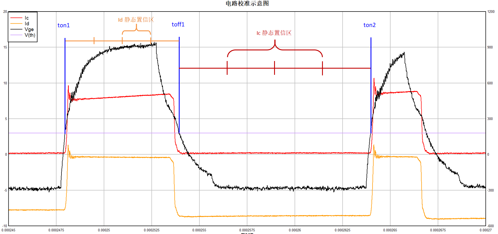
    &emsp;

 - #### Ictop & Icmax 计算
    &emsp;&emsp;计算当前电流top值以确定当前电流工况，同时计算电流工况下开通电流尖峰。
    ##### 电流计算
    &emsp;&emsp;正常情况下，Id的反向稳定电流均值应当与Ictop数值一样，但在有Id数据时，选取Idbase其实更为稳定。因此，优先选用Idbase作为工况电流；在无Id数据时，采用传统Ictop计算。
    - ##### Idbase计算过程
    - 选取置信区间（第二低关断掐头去尾留中间1/2）；
    - 区间内数据取平均得到Idbase；
    - 取负作为Ictop。
    - ##### Ictop计算过程
    - 取 (ton2 + 开通时长/2 , toff2)为Ictop搜寻区；
    - 在Ictop点搜寻区内寻找最大值；
    - 取最大值以及前9个点的电流值，共10个数；
    - 计算10个数平均为Ictop数值。
    &emsp;
    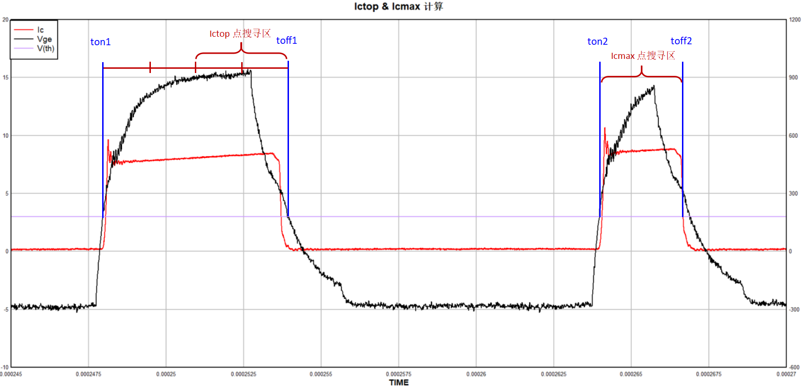
    ##### Icmax计算过程
    - 范围取(ton2 ,toff2)；
    - 在范围内寻找最大值为Imax。

    ##### 输出图像
    &emsp;&emsp;输出图像将绘制第二三次开通关断完整过程的Ic和Id。
    ###### 如下图所示：
    - 其中最左侧灰色标尺标记了Id调零置信区；
    - 中间标尺标记了Ic调零置信区；
    - 最下面的标尺标记了Idbase计算置信取；
    - 同时用红点标记了Ictop和Icmax的选取点位并标出了数据。
    &emsp;
    
    &emsp;

 - #### Vcetop 计算
    &emsp;&emsp;计算当前电压top值以确定当前电压工况。
    ##### Vcetop计算过程
    - 取 toff1 到 ton2 的 1/20 到3/20 为 Vcetop计算范围
    - 在区间内取平均值

    &emsp;
    区间范围见下图
     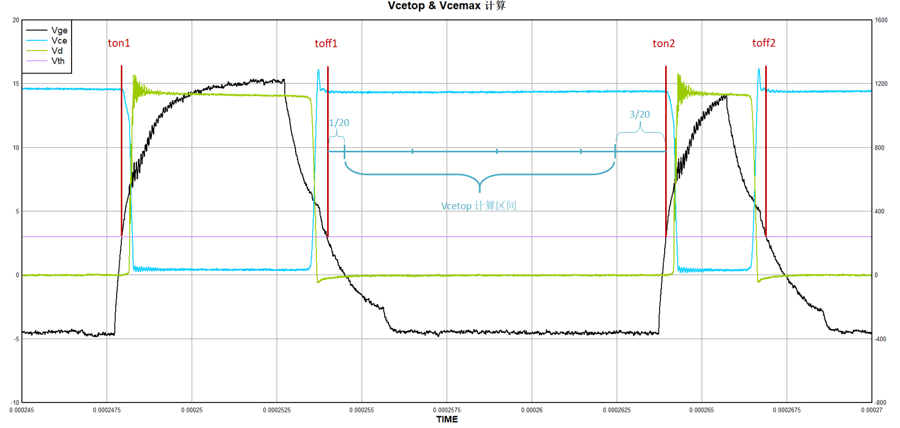

 - #### Vcemax & Vdmax 计算
    &emsp;&emsp;计算当前电压工况下关断Vce电压尖峰和开通Vd电压尖峰。
    ##### 计算过程
    - 取定范围
    - 范围内找最大值
    ##### 范围选取
    - Vcemax范围取(门极关断90%处 - 开通时长 ， 门极关断90%处 + 开通时长)
    - Vdmax范围取(ton2 - 开通时长 ， toff2)
    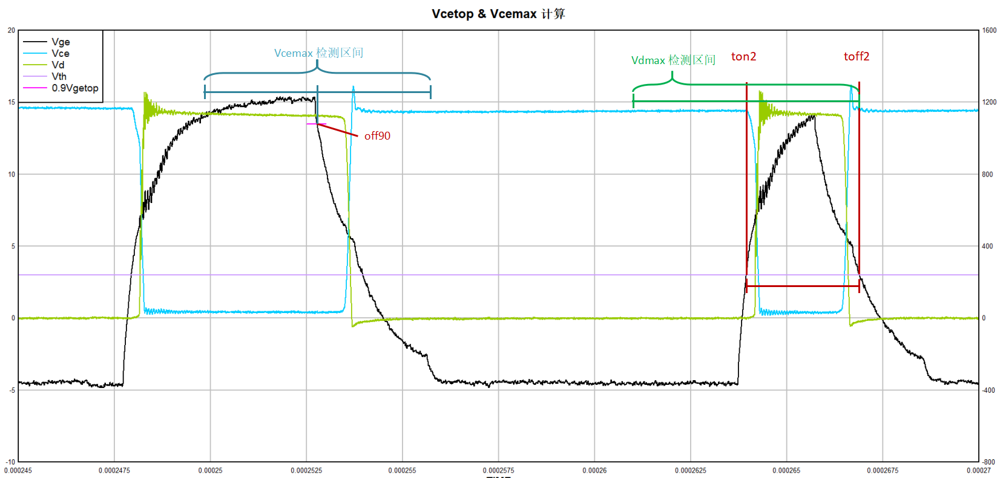
    &emsp;
    ##### 输出图像
    &emsp;&emsp;输出图像将绘制第二三次开通关断完整过程的Vce和Vd。
    ###### 如下图所示：
    - 其中灰色标尺标记了Vcetop计算置信区并标注了数值；
    - 红点标记了Vcemax点位并标出了数据。
    &emsp;
    
    &emsp;

- #### Eon & Eoff 计算
    &emsp;&emsp;计算开通关断损耗数据。
    ##### 计算过程
    - 取定损耗计算范围；
    - 将Ic和Vce相乘得到功率曲线；
    - 把功率曲线在损耗计算范围内积分得到损耗。
    ##### 范围选取
    &emsp;&emsp;首先，开通关断损耗的取点位置和扩充比例都来自于参数 Para_mode.Eonmode 和 Para_mode.Eoffmode ，假设填入值为 [a, b, c, d] 和 [e, f, g, h] 
    - ###### Eon范围选取
    - 开通时Ic上升阶段中的 a*Ictop 为开通起点
    - 开通时Vce下降阶段 b*Vcetop 为开通终点
    - 在上述开通起点 往前扩充 c 倍的开通长度 得到新的开通起始点
    - 在上述开通终点 往后扩充 d 倍的开通长度 得到新的开通终止点
    - 在上述 终点位置 识别不到时 将自动将终止位置比例增加 1% 若再搜寻不到再增加 最大5%
    - ###### Eoff范围选取
    - 关断时Vce上升阶段中的 e*Vcetop 为关断起点
    - 关断时Ic下降阶段中的 f*Ictop 为关断终点
    - 在上述关断起点 往前扩充 g 倍的关断长度 得到新的关断起始点
    - 在上述关断终点 往后扩充 h 倍的关断长度 得到新的关断终止点
    - 在上述 终点位置 识别不到时 将自动将终止位置比例增加 1% 若再搜寻不到再增加 最大5%
    ##### 关于范围选取
    &emsp;&emsp;在是否要在原选取范围中向前扩充的结果中对比如下图，左侧为未向前扩充的计算结果；右侧为向前扩充 20% 的结果。因为实际运用中，更小的寻找点在实际波形中受到震荡影响太过剧烈，而较大的选取点又会使得损耗计算漏掉之前的损耗部分。因此前后选点的基础上，增加了前后长度扩充的接口，实际使用中的选择操作请查看常见问题。
    下图中：
    - 左侧参数为 [0.1, 0.02, 0, 0] 
    - 右侧参数为 [0.1, 0.02, 0.2, 0] 
    &emsp;
    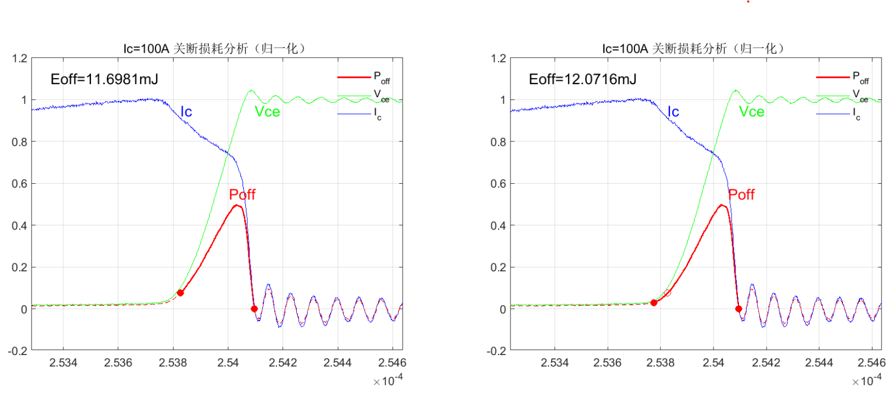
    &emsp;
    ##### 输出图像：
    &emsp;&emsp;在输出图像中，所有曲线都是经过了归一化，纵坐标量纲并无实际意义。
    其中:
    - 红色标记为电流电压相乘的功率曲线；
    - 实线部分为计算积分面积的功率曲线；
    - 虚线部分为未计入积分计算的部分；
    - 红色实心圆点标记为左右侧的起始点和结束点标记；
    - 若启用了长度延长，原本基础的选点将用空心红圈标记。
    &emsp;
    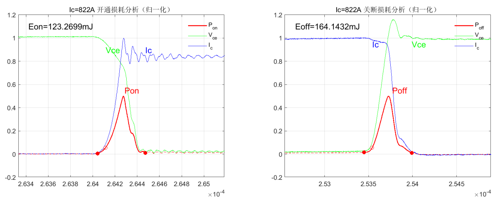
    &emsp;

- #### dvdt & didt 计算
    &emsp;&emsp;计算开通关断时刻dvdt和didt以衡量开关速度。
    ##### 计算过程
    - 选定起始点和结束点；
    - 计算出起始和结束点之间的电压/电流差和时间差；
    - 相除计算得出dvdt或者didt。
    ##### 范围选取
    - 在常规情况下选取的都是 10% ~ 90% 的上升区间，或 90% ~ 10% 的下降区间，但因为下降阶段偏慢同时有震荡，因此一般推荐 80% ~ 20%
    - 在 dvdtmode 和 didtmode 有特殊设置时按照设置位置寻点；
    ##### 输出图像：
    - 红色标记为变化率计算区；
    - 红色实心标记为变化率计算区的起始和结束点；
    - 蓝色空心标记为搜寻初筛范围 无实际意义。
    &emsp;
    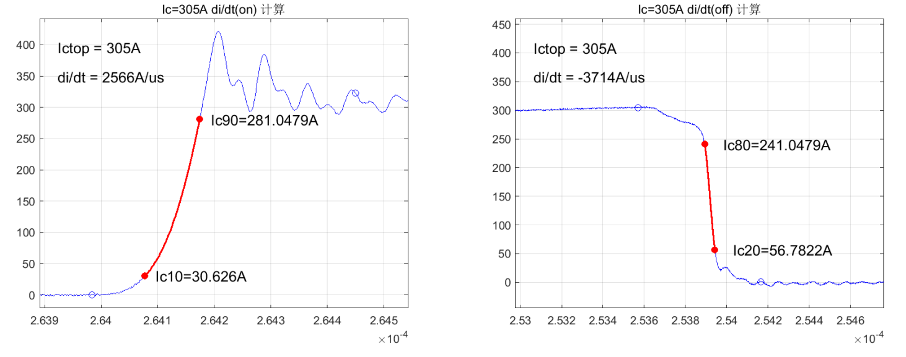
    &emsp;
    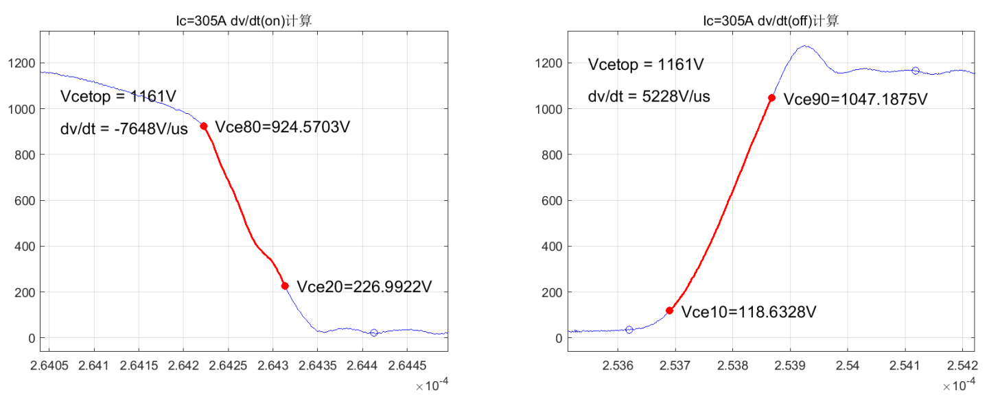
    &emsp;
    ##### 关于dvdt的范围点设置和didt的容错设置
    - 参见常见问题及解决方案

- #### Tdon & Tdoff 等参数计算
    &emsp;&emsp;整体参数还包括 Vgetop Vgebase 以及开关延迟时间 Tdon Tdoff 和开关上升下降时间 Trise Tfall
    &emsp;&emsp;计算 Vgetop 和 Vgebase 的意义在于，有了正确的 Vge  Top 值和 base 值才能识别出什么时候控制信号发生了改变。
    ##### 计算过程
    - ###### Vgetop 计算方式
    - 选取第二次开通前到第三次关断后的 Vge 数据；
    - 在上述数据中先筛除为负的数据；
    - 按照大小排序中再筛除最大的 5% 和最小的 90%；
    - 筛除上述选项后取中位数为 Vgetop。
    - ###### Vgebase 计算方式  
    - Vgebase 数据范围与 Vgetop 相同；
    - 在上述数据中先筛除为正的数据；
    - 按照大小排序中再筛除最小的 10% 和最大的 50% ；
    - 筛除上述选项后取中位数为 Vgebase。
    - ###### Tdon 和 Trise 计算
    - 选取第三次开通到第二次关断作为区间；
    - 在区间内倒序寻找首个超过 0.1Vgebase 的值；
    - 找到该值对应的时间作为开通信号发动时间 ton；
    - 以开通 didt 计算的起始点作为开通起始时间 didt_a；
    - 以开通 didt 计算的终点时间作为开通结束时间 didt_b；
    - 信号发动时间到开通起始时间即开通延时 Tdon = didt_a - ton；
    - 开通起始时间到结束时间即开通时间 Trise = didt_b - didt_a。
    - ###### Tdoff 和 Tfall 计算
    - 选取第二次关断到第二次开通作为区间；
    - 在区间内倒序寻找首个超过 0.9Vgetop 的值；
    - 找到该值对应的时间作为关断信号发动时间 toff；
    - 以关断 didt 计算的起始点作为关断起始时间 didt_c；
    - 以关断 didt 计算的终点时间作为关断结束时间 didt_d；
    - 信号发动时间到开通起始时间即开通延时 Tdoff = didt_c - toff；
    - 开通起始时间到结束时间即开通时间 Trise = didt_d - didt_c。
    ##### 输出图像：
    - 中间绿色部分为门极信号 Vge；
    - 红色为对应的延时部分 蓝色为对应的开关时间；
    - 灰色标记线标注了 Vgetop 和 Vgebase 的大小；
    - 红圈标记了识别到的 0.9Vgetop 和 0.1Vgebase；
    - 此外图像最下有一段缩小曲线为 Ic 的缩略图；
    - 同样以红色蓝色标注了阶段，方便对应查看。
    &emsp;
    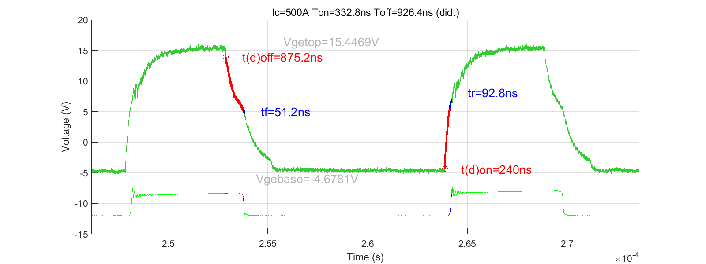
    &emsp;
    ##### 特殊模式：
    &emsp;&emsp;在无 Ic 输入，例如负载电流模式中，无 Ic 信息，理论上无法计算时间数据。但通过 dvdt 同样可以以相似流程计算出一组时间参数，只是两者完全不同，不能相互对比，但是可以给一个大致的参考。
    &emsp;
    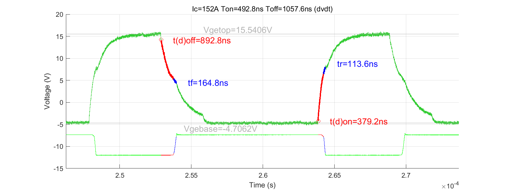
    &emsp;

- #### Prrmax & Erec 计算
    &emsp;&emsp;计算二极管最大反向恢复功率与反向恢复损耗。
    ##### 计算过程
    - 选取第二次开通时间到第二次关断时间为区间；
    - 区间内寻找 Id 首次从负变化到正的点为 Prr 起始点；
    - 同时寻找 Vd 上升到 0.9 Vcetop 的点作为结束点；
    - 在起始点到结束点之间将 Vd 与 Id相乘，得到 Prr
    - 寻找 Prr 的最大值得到 Prrmax；
    - 在 Prrmax 之后寻找一个 Prr 归零或下降沿打断的点作为结束点；
    - 从 Prr 起始点到结束点 积分得到Erec。
    - 具体结束点的选择逻辑与参数设置方法参见常见问题
    ##### 输出图像：
    - 中间绿色部分为门极信号 Vge；
    - 红色为对应的延时部分 蓝色为对应的开关时间；
    - 灰色标记线标注了 Vgetop 和 Vgebase 的大小；
    - 红圈标记了识别到的 0.9Vgetop 和 0.1Vgebase；
    - 此外图像最下有一段缩小曲线为 Ic 的缩略图；
    - 同样以红色蓝色标注了阶段，方便对应查看。
    ##### 输出图像：
    - 绿色部分为 Vd；
    - 蓝色部分为 Id；
    - 红色实线部分是计入积分区间的 Prr；
    - 蓝圈标记 Id 的过零点；
    - 灰色线段标记了 Erec 容错的左右范围；
    - 以极浅的淡蓝色虚线绘制了 Erec 随积分终点变化的函数。
    &emsp;
    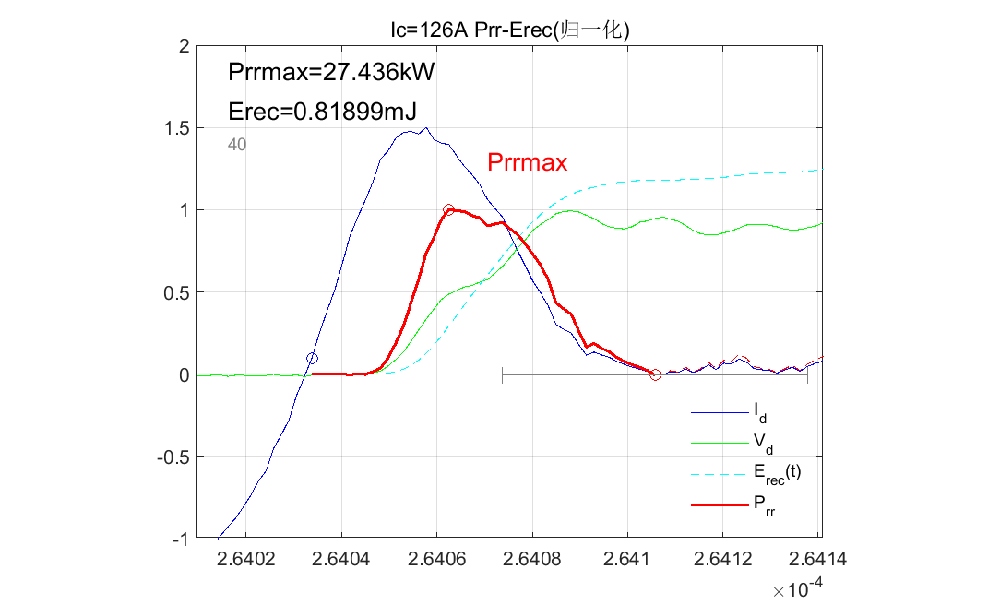
    &emsp;

## 常见问题及解决方案
- #### 通道分配时，若有数据是示波器Math通道，如何填写对应通道分配？
    1. 首先最重要的一点是，该组实验过程中，不要打开或关闭某一通道，保持该组数据所有文件的通道对应关系一致。
    2. 以表格形式打开该组中的csv文件，查看对应数据所在的列，具体情况可能如下图所示：(若未开启CH2但开启了CH3，就会如下图所示B列为CH1、C列为CH3)
    &emsp;
        |TIME   |CH1    |CH3    |(空)   |TIME   |MATH1  |MATH2  |
        |----   |----   |----   |----   |----   |----   |----   |
        |#TIME  |#DATA  |#DATA  |       |#TIME  |#DATA  |#DATA  |
        |#TIME  |#DATA  |#DATA  |       |#TIME  |#DATA  |#DATA  |
    &emsp;
    3. 从左往右开始数，以CH1为第一列，例如CH3为2,、MATH1为5、MATH2为6。
    4. 需求对应的列数填入通道分配参数数组中，例如MATH2实际为Id时，通道分配参数第五位填写6。
- #### 如何判断dvdt是否应该手动选择计算区间，应当怎么设置参数？
    1. dvdt是否应该手动设置区间取决于器件特性，实际运行时可以先以10%到90%Vce的参数运行一遍，然后观察输出图像。
    2. 若输出图像如下左图所示，明显可以看出Vce在100V以下时还在缓慢抬升阶段，如果此时以10%Vce为起始点，dvdt将只有3561V/us，很显然无法表征其电压变化速度。因此我们需要调整计算区间，尽量使得起始点在缓慢抬升阶段之后。
    &emsp;
    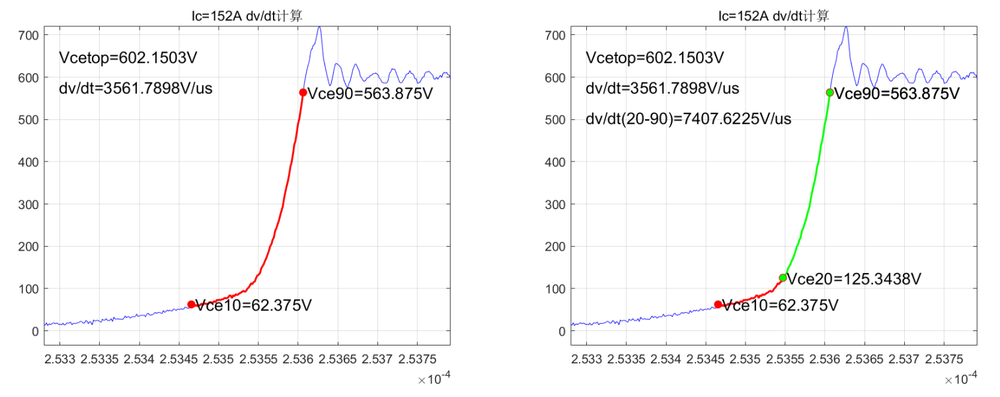
    &emsp;   
    3. 例如改为[20,90]后，输出结果将如上右图，此时dvdt的计算就排除了缓慢上升段的影响到达了7407V/us，更加能反映电压上升速度。

- #### 何时应该开启didt上升容错，设置为多少合适？
    1. 启用didt状态机检测起始点，目的在于排除电流开始上升前的电流抖动。如下图所示：
    &emsp;
    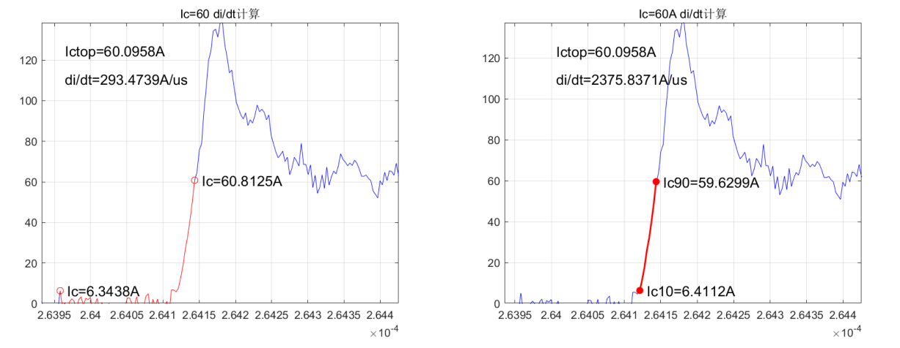
    &emsp;
    2. 启用该算法后，若是上升阶段数据线严格上升，其实是不用设置容错的。但是如果在上升过程中，因为抖动，有下降毛刺时才需要启动该选项。如下右图，因为在约120A的位置有一处下降毛刺，因此严格上升的检查不通过，起始点被移到毛刺后，虽然数值可能相差不大，但这样的didt计算方式是有问题的。
    &emsp;
    
    &emsp;
    3. 在启用上升沿容错后，输出图像将如上左图所示，不会收毛刺干扰。若仅只有些微毛刺，参数可以给小一点2、3或者5；如果震荡剧烈就要考虑更大的参数，但是一般不要超过10。

- #### Erec计算时下降容错应该怎么填？
    1. 首先，Erec下降沿判断反向恢复结束点的原理与didt上升沿检测类似，只不过变成了检测下降沿。对于理想中的波形，电流电压都无多大振动的情况下，也是几乎不需要设置容错的，如下图所示。
    &emsp;
    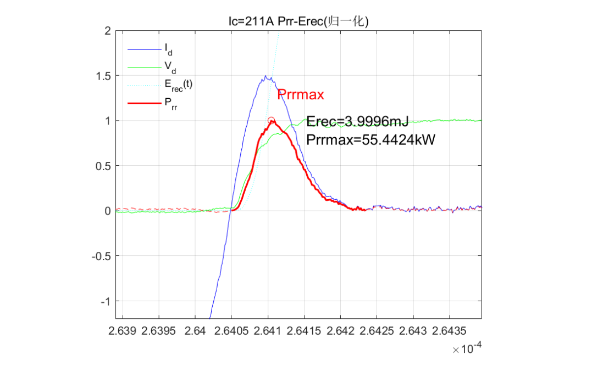
    &emsp;
    2. 但是有时因为电压电流都有不小的震荡，再加上反向恢复功率是电压电流的乘积。所以当反向恢复功率剧烈震动的时候，排除程序的原因，人工在示波器上都无法判断反向恢复阶段，这种情况属于神仙难救，如下图，毕竟再高超的数据处理手段都挽回不了数据采集时候的信息损失，因此在此处仅提供两种数据有参考意义时的参数填写办法。
    &emsp;
    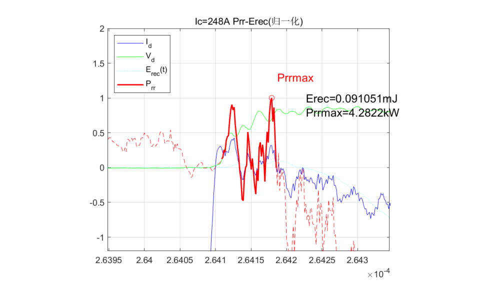
    &emsp;
    3. 第一种是如下图所示的情况，反向恢复的尖峰并没有多震荡，在Prrmax点后直接单调递减到反向恢复结束，但是在反向恢复快结束的位置开始震荡，而且要震荡多个峰迟迟不降到0。此时若给的容错太大，后续的几个震荡波都会计算进Erec中，因此此时容错值应该给小一点，10左右。
    &emsp;
    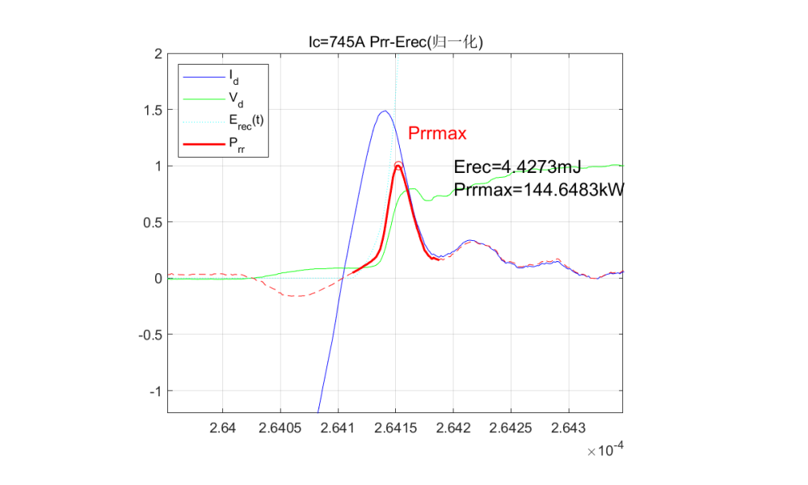
    &emsp;
    4. 第二种则是如下图，虽然反向恢复尖峰震荡剧烈，但是反向恢复阶段结束时的归零处并不震荡，可以明显确定其归零的位置。此时就可以把容错值设得大一点，防止漏算几个震荡的波，让归零点触发结束。
    &emsp;
    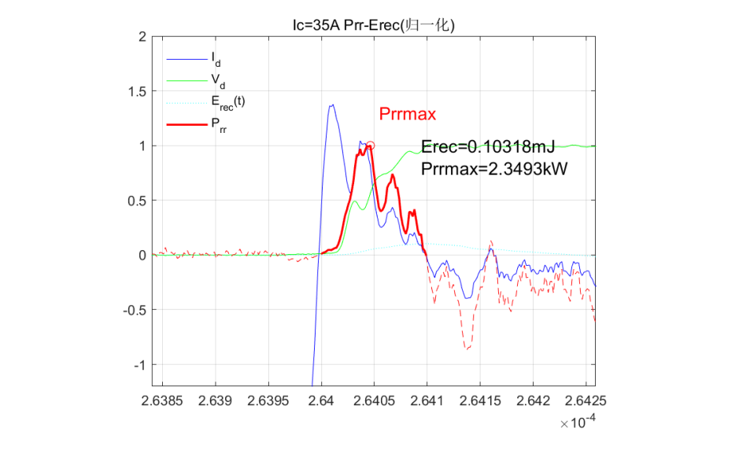
    &emsp;

- #### 如何选择合适的开通关断损耗的选点和延长参数？
    1. 通常的推荐参数为 [0.1, 0.02, 0.2, 0] ，开通关断都是，即左侧取 10% ，右侧取 2% ；随后在此基础上向前延长 20%。实际操作时，可以先以推荐参数运行，然后查看输出图像，视情况修改参数再运行。
    2. 理论上经过放宽机制是已经不会出现整体运行不下去报错的情况，但如果出现报错语句类似于 "Eon计算起点识别失败" ，即表明第一二个参数设置得太过苛刻找不到这样的点，需要放宽条件。
    3. 若有输出图像，但是计算的数值似乎很大，可能类似下图情况，由于选点的一二个参数还是过于严苛，以至于找到一个符合的点时，已经额外多算了很长一段时间的导通损耗。
    &emsp;
    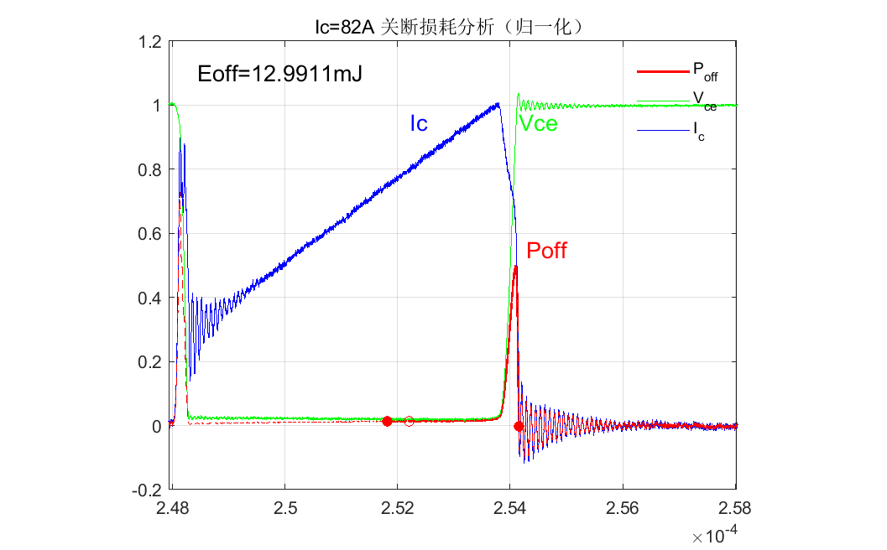
    &emsp;
    4. 但是在放宽条件的同时也会出现部分损耗未计算在内的情况，如下图中的左侧部分 参数 [0.1, 0.02, 0, 0] ,取值 10% Vcetop 又似乎太保守了。因此可以考虑引入延长扩充机制，如右边图像所示 参数 [0.1, 0.02, 0.2, 0] ，右侧图像是在 10% Vcetop 的基础上又往左延长了 20% 的长度。
    &emsp;
    
    &emsp;
    5. 当然同样存在延长扩充值取得太大的情况，如下图(为夸张显示 向前扩充了 100%)，此时应当减小扩充比例。
    &emsp;
    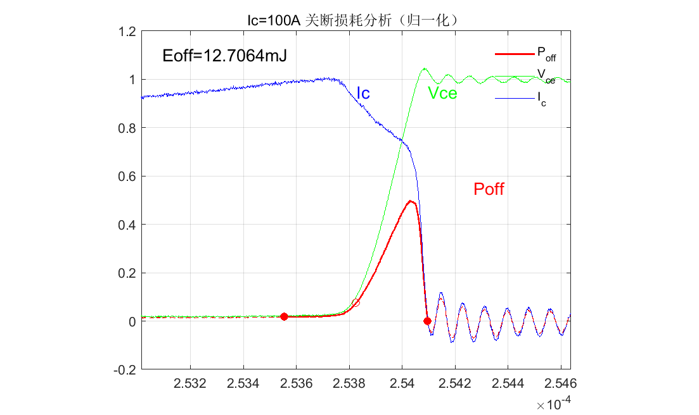
    &emsp;
    6. 总得来说，选点和扩充范围参数应当是互补，相辅相成，尽量以合适参数选点，然后辅助以扩充比例精准化数据。